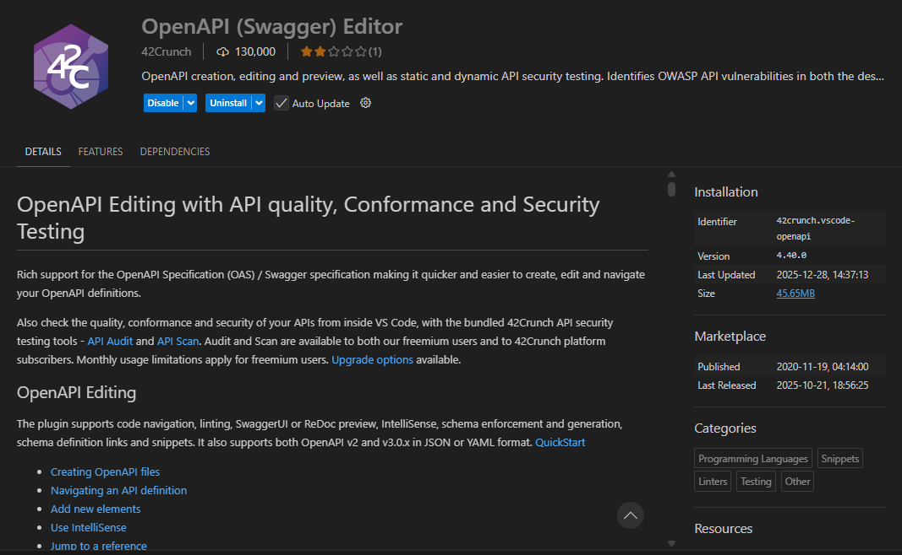
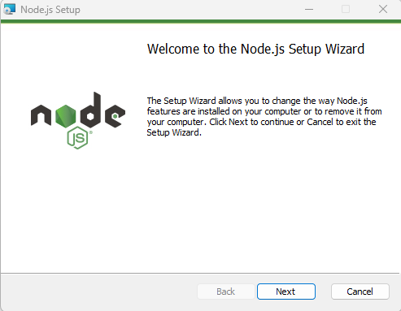

# Publishing Business Central APIs in SwaggerUI

This project has 2 YAML files, one for standard Microsoft API and one for NBS.

| File | Description |
|------|-------------|
| MicrosoftAPIv1.0.yaml | Standard Microsoft Business Central API v1.0 |
| NBSAPI.yaml | NBS custom API v2.0 |

## OpenAPI

The first step is to install the OpenAPI (Swagger) Editor extension in Visual Studio Code (VSC).

1. Open VSC
2. Go to Extensions (Ctrl+Shift+X)
3. Search for "OpenAPI (Swagger) Editor"
4. Install the extension by 42Crunch

This extension provides syntax highlighting, validation, and preview for OpenAPI/Swagger files.



## Node.js

Node.js is required to run the Swagger UI server.

1. Download Node.js from: <https://nodejs.org/>
2. Install Node.js (LTS version recommended)
3. Verify installation by running in terminal:
   
   ```
   node --version
   npm --version
   ```
   


## Run Swagger UI

### Install Dependencies

Open a terminal in the project folder and run:

```
npm install
```

This will install the required packages: express, swagger-ui-express, and yamljs.

### Start the Server

To view the NBS API documentation:

```
node swagger_bc_nbs.js
```

To view the Microsoft API documentation:

```
node swagger_bc_microsoft.js
```

### Access Swagger UI

Open your browser and navigate to:

```
http://localhost:3100
```

The Swagger UI will display the API documentation with all available endpoints, request/response schemas, and the ability to test API calls directly.
